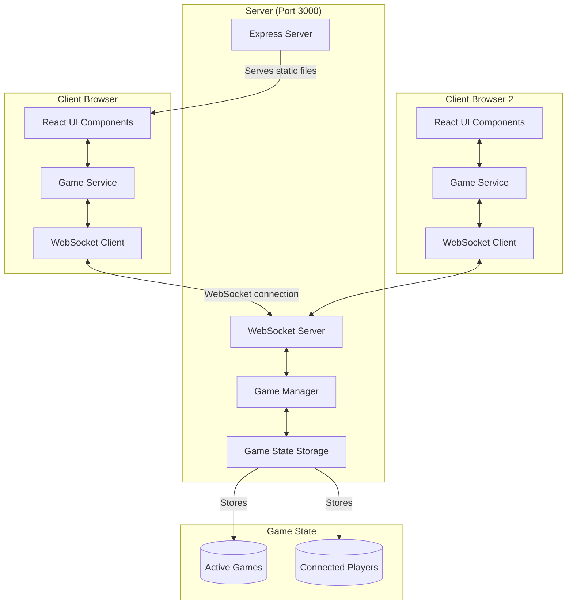

# Quoridor Multiplayer Architecture



## Components Description

### Client-Side Components

1. **React UI Components (`/src/components/Game.jsx`)**

   - Renders game board and pieces
   - Handles user interactions
   - Displays game state and player info

2. **Game Service (`/src/services/gameService.js`)**

   - Manages WebSocket connection
   - Handles game state updates
   - Processes moves and wall placements

3. **WebSocket Client**
   - Maintains connection to server
   - Sends/receives game messages
   - Auto-reconnects on disconnection

### Server-Side Components

1. **Express Server (`/server/server.js`)**

   - Serves static React application
   - Handles HTTP requests
   - Provides SPA routing support

2. **WebSocket Server**

   - Manages real-time game communications
   - Handles player connections/disconnections
   - Routes messages to appropriate game sessions

3. **Game Manager**

   - Creates and manages game sessions
   - Validates moves and wall placements
   - Updates game state

4. **Game State Storage**
   - Stores active games and their states
   - Tracks connected players
   - Maintains wall counts and positions

## Communication Flow

1. **Initial Connection**

   ```
   Browser -> Express Server: HTTP GET /
   Express Server -> Browser: Sends React application
   Browser -> WebSocket Server: Establishes WS connection
   ```

2. **Game Creation/Joining**

   ```
   Client -> Server: JOIN_GAME (gameId)
   Server -> Client: GAME_JOINED (playerNumber, gameState)
   ```

3. **Game Play**

   ```
   Client -> Server: MAKE_MOVE (move details)
   Server -> All Clients: GAME_STATE (updated state)
   ```

4. **Disconnection**
   ```
   Client Disconnects
   Server -> Other Client: PLAYER_DISCONNECTED
   ```

## Data Flow Architecture

1. **Move Processing**

   ```
   User Input -> React Component
   -> Game Service
   -> WebSocket Client
   -> Server
   -> Game Manager
   -> Game State Update
   -> Broadcast to Players
   ```

2. **Wall Placement**
   ```
   User Input -> React Component
   -> Game Service
   -> WebSocket Client
   -> Server
   -> Validate Wall Position
   -> Update Game State
   -> Broadcast to Players
   ```

## Single Port Architecture

All communication happens over port 3000:

- HTTP: `http://server:3000` - Serves the React application
- WebSocket: `ws://server:3000` - Handles real-time game communication

This unified approach simplifies deployment and network configuration while maintaining separation of concerns in the codebase.
