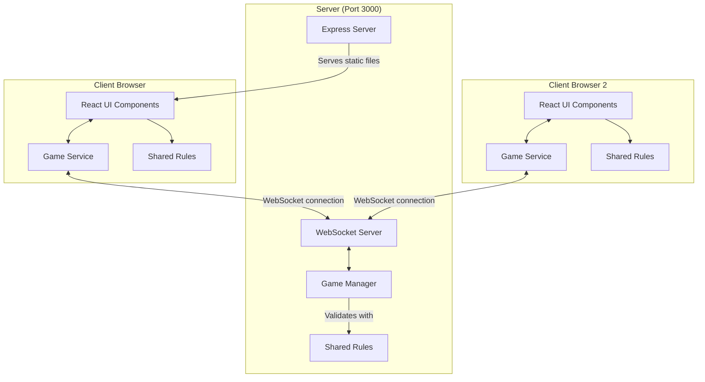

# Quoridor Multiplayer Architecture



## Components Description

### Client-Side Components

1. **React UI Components (`/src/components/Game.tsx`)**

   - Renders game board and pieces
   - Handles user interactions
   - Displays game state and player info

2. **Game Service (`/src/services/gameService.ts`)**

   - Manages the WebSocket connection
   - Sends joins, moves, undo requests and undo votes
   - Passes server state updates and errors to the UI

3. **Shared Rules (`/shared/rules.ts`)**
   - Seats, goals, legal pawn moves and wall placements for up to four players
   - Used by the browser for move hints and wall previews, and by the server to validate every move
   - Data shapes shared by both sides live in `/shared/types.ts`; WebSocket message types live in `/shared/messages.ts`

### Server-Side Components

1. **Express Server (`/server/server.ts`)**

   - Serves static React application
   - Handles HTTP requests
   - Provides SPA routing support

2. **WebSocket Server**

   - Manages real-time game communications
   - Handles player connections/disconnections
   - Routes messages to appropriate game sessions

3. **Game Manager (`/server/games.ts`)**

   - Creates games, seats up to four players, and locks joining after the first move
   - Validates and applies moves with the shared rules
   - Keeps each game's undo history and runs unanimous undo votes
   - Skips players who leave mid-game
   - Holds games, their state, and undo history in memory

## Communication Flow

1. **Initial Connection**

   ```
   Browser -> Express Server: HTTP GET /
   Express Server -> Browser: Sends React application
   Browser -> WebSocket Server: Establishes WS connection
   ```

2. **Game Creation/Joining**

   ```
   Client -> Server: JOIN_GAME (gameId, playerName)
   Server -> Client: GAME_JOINED (playerNumber, gameState) or GAME_ERROR
   Server -> All Clients in game: GAME_STATE
   ```

3. **Game Play**

   ```
   Client -> Server: MAKE_MOVE (move)
   Server -> All Clients in game: GAME_STATE, or GAME_ERROR to the sender
   ```

4. **Undo**

   ```
   Client -> Server: REQUEST_UNDO
   Each client -> Server: VOTE_UNDO (approve)
   Server -> All Clients in game: GAME_STATE (vote progress, then the restored state or the decline)
   ```

5. **Disconnection**
   ```
   Client Disconnects
   Server -> Remaining Clients: GAME_STATE (player marked as left)
   ```

## Data Flow Architecture

1. **Move Processing**

   ```
   User Input -> React Component
   -> Game Service
   -> Server
   -> Game Manager (validates with Shared Rules)
   -> Update Game State
   -> Broadcast to Players
   ```

2. **Wall Placement**
   ```
   User Input -> React Component
   -> Game Service
   -> Server
   -> Game Manager (validates with Shared Rules)
   -> Update Game State
   -> Broadcast to Players
   ```

## Single Port Architecture

All communication happens over port 3000:

- HTTP: `http://server:3000` - Serves the React application
- WebSocket: `ws://server:3000` - Handles real-time game communication

With Docker (`docker compose up --build`), the server still listens on port 3000 inside the container and `APP_PORT` picks the host port. The browser builds the WebSocket URL from the page address, so it follows whatever host port is mapped.

This unified approach simplifies deployment and network configuration while maintaining separation of concerns in the codebase.
